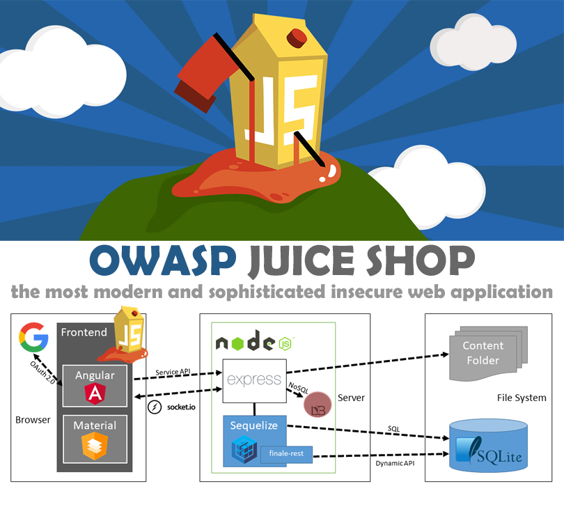

  

¡OWASP Juice Shop es probablemente la aplicación web insegura más moderna y sofisticada! Se puede usar en capacitaciones de seguridad, demostraciones de concientización, CTF y como conejillo de indias para herramientas de seguridad. Juice Shop abarca vulnerabilidades de todo el Top Ten de OWASP junto con muchas otras fallas de seguridad que se encuentran en aplicaciones del mundo real.

