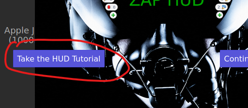

<p align="center">
  
</p>

¡OWASP Juice Shop es probablemente la aplicación web insegura más moderna y sofisticada! Se puede usar en capacitaciones de seguridad, demostraciones de concientización, CTF y como conejillo de indias para herramientas de seguridad. Juice Shop abarca vulnerabilidades de todo el Top Ten de OWASP junto con muchas otras fallas de seguridad que se encuentran en aplicaciones del mundo real.


## Desarrollo de la práctica:

Esta práctica se realizó con este video: [https://www.youtube.com/watch?v=fiq59DuhY68&t](https://www.youtube.com/watch?v=fiq59DuhY68&t)

* El **objetivo** de esta práctica es ejecutar algunas de las principales técnicas de inyección SQL contra la aplicación web de prueba (OWASP Juice Shop) y obtener información importante de la base de datos.

Instalar Kali Linux en una máquina virtual. En mi caso en el virtualizador VMWare. Tener la configuración de la red de la máquina linux en bridge.

<p align="center">
  
</p>

Tuve un problema para la configuración de bridge en vmware, y lo resolví siguiendo lo que dicen aqui: [https://www.youtube.com/watch?v=Ct6B6DTDOcE](https://www.youtube.com/watch?v=Ct6B6DTDOcE)

Cambiar contraseña de kali con:
```
passwd
```

Instalación de Docker en linux con esta página (donde dice install docker): [https://cybr.com/cybersecurity-fundamentals-archives/how-to-set-up-the-dvwa-on-kali-with-docker/](https://cybr.com/cybersecurity-fundamentals-archives/how-to-set-up-the-dvwa-on-kali-with-docker/)
<br><br>
Descargamos y corremos la máquina de pruebas de OWASP llamada OWASP Juice Shop ( [https://owasp.org/www-project-juice-shop/](https://owasp.org/www-project-juice-shop/) ), la cual se corre en docker.
<br><br>
Con este comando se descarga y se corre el contenedor: 
```
docker run --rm -p 3000:3000 bkimminich/juice-shop
```
<br><br>
Podemos visualizar el sitio web en [http://127.0.0.1:3000/](http://127.0.0.1:3000/)

<p align="center">
  
</p>

Vamos a usar la herramienta ZAP ( [https://www.zaproxy.org/](https://www.zaproxy.org/) ) y sirve para hacer “man in the middle proxy”, y podremos hacer peticiones al backend a pesar que el frontend tenga alguna capa de seguridad. Esta herramienta viene preinstalada con kali linux. La alternativa de zap es Burpsuite, pero es de pago menos la versión básica. 


<p align="center">
  
</p>

En zap ponemos prueba manual y lanzamos el proxy de la página de OWASP: 

<p align="center">
  
</p>


<p align="center">
  
</p>

Se recomienda ver el tutorial “HUD Tutorial” donde se muestra la funcionalidad de cada uno de los botones que aparecen en los costados del navegador al usar la herramienta ZAP HUB:

<p align="center">
  
</p>

Después de ver el tutorial, vamos a usar el buscador que tiene el aplicativo web para hacer nuestro primer comando de inyección SQL. Lo podemos hacer directamente en la barra de búsqueda o modificando la petición de nuestro método GET:
<p align="center">
  
</p>

```sql
' or 1=1; --
```
<p align="center">
  
</p>

Y obtenemos una respuesta 500 de error en el servidor, lo cual es una buena señal porque nos entrega información del gestor de base de datos que se usa, el cual en este caso es SQLite:

<p align="center">
  
</p>
 
Conocido que el gestor de la base de datos es SQLite, sabemos que existe una tabla que se crea por defecto en esta BD llamada sqlite_master y nos puede entregar mucha información, por ejemplo, las tablas que contiene la BD.
<br><br>
Estructura de la tabla sqlite_master:

<p align="center">
  
</p>

Usaremos el comando UNION para que nos traiga el nombre de todas las tablas, contenidas en sqlite_master:

```sql
')) UNION SELECT name,name,name,name,name,name,name,name,name FROM sqlite_master WHERE type='table' --
```

<p align="center">
  
</p>

<p align="center">
  
</p>

<p align="center">
  
</p>

Y nos damos cuenta que efectivamente tiene 9 columnas y nos imprime el nombre de las tablas de la bd (ej: Wallets, Users). También, podemos usar sql injection para ver la versión de la base de datos, usando un comando parecido al anterior:

```sql
')) UNION SELECT sqlite_version(),sqlite_version(),sqlite_version(),
sqlite_version(),sqlite_version(),sqlite_version(),sqlite_version(),
sqlite_version(),sqlite_version(); --
```

<p align="center">
  
</p>

<p align="center">
  
</p>

Nos damos cuenta que la versión de esta base de datos es sqlite 3.34.0. Y al consultar la última versión nos damos cuenta que es la 3.36.0 ( [https://www.sqlite.org/changes.html](https://www.sqlite.org/changes.html) )

<p align="center">
  
</p>

Procedemos a buscar vulnerabilidades de la versión 3.34.0:

<p align="center">
  
</p>
Aquí se puede intentar buscar vulnerabilidades para explotarlas (No se hace en esta práctica)  
<br><br>
Al hacer fuzzing al poner a correr el escaneo automatico de ZAP, nos encontramos que la ruta /login retorna un usuario y una codificación de json. Vamos a analizar la vulnerabilidad manualmente:

<p align="center">
  
</p>

```
Email:
' or 1=1; --
  
Password:
cualquiera,_realmente_no_importa
```

<p align="center">
  
</p>

<p align="center">
  
</p>

<p align="center">
  
</p>

Lo que hicimos es que el sistema ignore el campo de contraseña y loguearnos con el primer usuario en la base de datos, el cual en este caso es el usuario administrador:

<p align="center">
  
</p>

Vemos que nos retorna un json de autenticación, tiene el id 1 (id de la base de datos), y el correo es admin@juice-sh.op. También nos trae un token que viene codificado en formato json. Vamos a ver que tiene este token:

```
eyJ0eXAiOiJKV1QiLCJhbGciOiJSUzI1NiJ9.eyJzdGF0dXMiOiJzdWNjZXNzIiwiZGF0YSI6eyJpZCI6MSwidXNlcm5hbWUiOiIiLCJlbWFpbCI6ImFkbWluQGp
1aWNlLXNoLm9wIiwicGFzc3dvcmQiOiIwMTkyMDIzYTdiYmQ3MzI1MDUxNmYwNjlkZjE4YjUwMCIsInJvbGUiOiJhZG1pbiIsImRlbHV4ZVRva2VuIjoiIiwibGF
zdExvZ2luSXAiOiIwLjAuMC4wIiwicHJvZmlsZUltYWdlIjoiYXNzZXRzL3B1YmxpYy9pbWFnZXMvdXBsb2Fkcy9kZWZhdWx0QWRtaW4ucG5nIiwidG90cFNlY3J
ldCI6IiIsImlzQWN0aXZlIjp0cnVlLCJjcmVhdGVkQXQiOiIyMDIxLTExLTI3IDAwOjIyOjA3LjE0OCArMDA6MDAiLCJ1cGRhdGVkQXQiOiIyMDIxLTExLTI3IDA
wOjIyOjA3LjE0OCArMDA6MDAiLCJkZWxldGVkQXQiOm51bGx9LCJpYXQiOjE2Mzc5NzM2MDMsImV4cCI6MTYzNzk5MTYwM30.chdeBDOaG8C2wna9eAQK0cphwRs
12aavkEE3wLnXx2mdeFmrAKZ7CCHjq8PHaQ44qnjCfx8u_Vx8BxMljj3vHjUnSif2OJdHZ2At4jtO_2PruICnxHHF7cCu6opvMEcpDtF0PlJzQjL1JkcfiAdKyWO
WUbMP5M0UGu7vNol4Qzo
```

Aqui podemos decodificar el json: [https://jwt.io/](https://jwt.io/)

<p align="center">
  
</p>

La contraseña está cifrada. Por lo que recurrimos a una herramienta llamada “hash-identifier” que tiene kali linux preinstalada, para conocer el posible algoritmo de cifrado que tiene la contraseña:

<p align="center">
  
</p>

<p align="center">
  
</p>

Me dice que posiblemente tiene MD5

<p align="center">
  
</p>

<p align="center">
  
</p>

<p align="center">
  
</p>

Entonces ahora podemos ingresar con admin@juice-sh.op y admin123

<p align="center">
  
</p>

Intentaremos una forma de encontrar todos los usuario por medio de la barra de búsqueda:

```sql
kjalsdfjkk')) UNION SELECT id,email,password,null,null,null,null,null,null FROM Users; -- 
```
<p align="center">
  
</p>

Obtenemos:

<p align="center">
  
</p>

Obtenemos el id, el correo y la contraseña en md5 de los usuarios, y ha sido mapeado a los objetos del sitio web (artículos de jugos). Y teniendo en cuenta esta estructura que tiene la tabla **sqlite_master**, procedemos a ver las sentencias SQL para la creación de las tablas actuales:

```sql
jklaj')) UNION SELECT sql,'1','1','1','1','1','1','1','1' FROM sqlite_master; --
```

<p align="center">
  
</p>

Obtenemos lo siguiente:

<p align="center">
  
</p>

Otro reto consiste en comprar un artículo escondido, el cual tiene el id 10. Para ello debemos agregar cualquier otro producto al carro, y usaremos este método post para crear otro nuevo, donde le cambiaremos el id del producto por 10:

<p align="center">
  
</p>

Y obtenemos una respuesta exitosa:

<p align="center">
  
</p>

Y al presionar en la cesta vemos nuestro artículo escondido:

<p align="center">
  
</p>

Y compramos la caja sorpresa: 

<p align="center">
  
</p>

De esta forma superamos otro reto.
